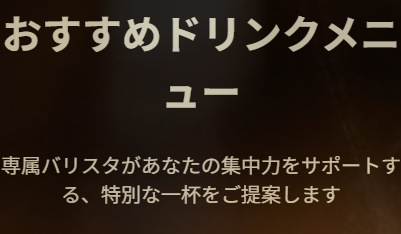
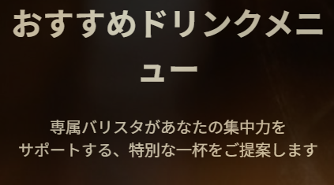
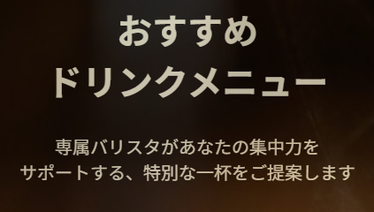

# virtual-case-cafe
AI生成の仮想案件によるコーディング練習

# 仮想案件の概要
* [仮想案件.docx](./案件概要.docx)
* [追加要望](./クライアントからの追加要望.docx)

# 仕様素材
* main-visual:
<a href="https://unsplash.com/ja/%E5%86%99%E7%9C%9F/%E3%83%86%E3%83%BC%E3%83%96%E3%83%AB%E3%81%AE%E8%BF%91%E3%81%8F%E3%81%AE%E7%B7%91%E3%81%AE%E8%91%89%E3%81%AE%E6%A4%8D%E7%89%A9-QnUywvDdI1o?utm_source=unsplash&utm_medium=referral&utm_content=creditCopyText">Unsplash</a>の<a href="https://unsplash.com/ja/@heftiba?utm_source=unsplash&utm_medium=referral&utm_content=creditCopyText">Toa Heftiba</a>が撮影した写真

* Wi-Fiの画像: <a href="https://unsplash.com/ja/%E5%86%99%E7%9C%9F/%E7%B7%91%E3%81%A8%E7%99%BD%E3%81%AE%E3%83%A9%E3%83%99%E3%83%AB%E4%BB%98%E3%81%8D%E3%83%9C%E3%83%83%E3%82%AF%E3%82%B9-L-mHnEJXR6A?utm_source=unsplash&utm_medium=referral&utm_content=creditCopyText">Unsplash</a>の<a href="https://unsplash.com/ja/@markusspiske?utm_source=unsplash&utm_medium=referral&utm_content=creditCopyText">Markus Spiske</a>が撮影した写真

* コンセントの画像: <a href="https://unsplash.com/ja/%E5%86%99%E7%9C%9F/%E3%82%B3%E3%83%B3%E3%82%BB%E3%83%B3%E3%83%88%E3%81%AE%E5%89%8D%E3%81%AB%E3%81%82%E3%82%8B%E9%BB%92%E3%81%84%E3%82%AA%E3%82%B9%E3%83%97%E3%83%A9%E3%82%B0-exfrR9KkzlE?utm_source=unsplash&utm_medium=referral&utm_content=creditCopyText">Unsplash</a>の<a href="https://unsplash.com/ja/@cbpsc1?utm_source=unsplash&utm_medium=referral&utm_content=creditCopyText">Clint Patterson</a>が撮影した写真

* バリスタの画像: <a href="https://unsplash.com/ja/%E5%86%99%E7%9C%9F/%E9%9D%92%E3%81%A8%E7%99%BD%E3%81%AE%E3%83%81%E3%82%A7%E3%83%83%E3%82%AF%E6%9F%84%E3%81%AE%E3%83%9C%E3%82%BF%E3%83%B3%E3%82%A2%E3%83%83%E3%83%97%E3%82%B7%E3%83%A3%E3%83%84%E3%82%92%E7%9D%80%E3%81%9F%E7%94%B7%E3%81%8C%E3%83%9E%E3%82%B0%E3%82%AB%E3%83%83%E3%83%97%E3%82%92%E6%8C%81%E3%81%A3%E3%81%A6%E3%83%86%E3%83%BC%E3%83%96%E3%83%AB%E3%81%AE%E5%89%8D%E3%81%AB%E7%AB%8B%E3%81%A4-_rraO9NirHE?utm_source=unsplash&utm_medium=referral&utm_content=creditCopyText">Unsplash</a>の<a href="https://unsplash.com/ja/@brookecagle?utm_source=unsplash&utm_medium=referral&utm_content=creditCopyText">Brooke Cagle</a>が撮影した写真

* エディターズ・ブレンドの画像: <a href="https://unsplash.com/ja/%E5%86%99%E7%9C%9F/%E6%9C%A8%E8%A3%BD%E3%81%AE%E3%83%86%E3%83%BC%E3%83%96%E3%83%AB%E3%81%AE%E4%B8%8A%E3%81%AB%E7%BD%AE%E3%81%8B%E3%82%8C%E3%81%9F%E4%B8%80%E6%9D%AF%E3%81%AE%E3%82%B3%E3%83%BC%E3%83%92%E3%83%BC-Urz7T90arUM?utm_source=unsplash&utm_medium=referral&utm_content=creditCopyText">Unsplash</a>の<a href="https://unsplash.com/ja/@andybodemer?utm_source=unsplash&utm_medium=referral&utm_content=creditCopyText">Andy Bodemer</a>が撮影した写真

* リカバリー・シングルオリジンの画像: <a href="https://unsplash.com/ja/%E5%86%99%E7%9C%9F/%E9%9D%92%E3%81%84%E5%8F%97%E3%81%91%E7%9A%BF%E3%81%AE%E4%B8%8A%E3%81%AE%E9%9D%92%E3%81%84%E9%99%B6%E7%A3%81%E5%99%A8%E3%81%AE%E3%82%B3%E3%83%BC%E3%83%92%E3%83%BC-%E3%82%AB%E3%83%83%E3%83%97-DvaoJEksloQ?utm_source=unsplash&utm_medium=referral&utm_content=creditCopyText">Unsplash</a>の<a href="https://unsplash.com/ja/@danielnorris?utm_source=unsplash&utm_medium=referral&utm_content=creditCopyText">Daniel Norris</a>が撮影した写真

* アフターグロウ・ラテの画像: <a href="https://unsplash.com/ja/%E5%86%99%E7%9C%9F/%E6%9C%A8%E8%A3%BD%E3%81%AE%E3%83%86%E3%83%BC%E3%83%96%E3%83%AB%E3%81%AE%E5%8F%97%E3%81%91%E7%9A%BF%E3%81%AE%E4%B8%8A%E3%81%AE%E3%82%AB%E3%83%97%E3%83%81%E3%83%BC%E3%83%8E-fIEN3ccZVMk?utm_source=unsplash&utm_medium=referral&utm_content=creditCopyText">Unsplash</a>の<a href="https://unsplash.com/ja/@shotsbymargo?utm_source=unsplash&utm_medium=referral&utm_content=creditCopyText">Margo</a>が撮影した写真

* おすすめメニューページの背景画像: <a href="https://unsplash.com/ja/%E5%86%99%E7%9C%9F/%E7%99%BD%E3%81%84%E7%85%99%E3%81%A8%E8%8C%B6%E8%89%B2%E3%81%AE%E3%82%BB%E3%83%A9%E3%83%9F%E3%83%83%E3%82%AF%E3%82%AB%E3%83%83%E3%83%97-PSqT-lQAt7A?utm_source=unsplash&utm_medium=referral&utm_content=creditCopyText">Unsplash</a>の<a href="https://unsplash.com/ja/@tabithaturnervisuals?utm_source=unsplash&utm_medium=referral&utm_content=creditCopyText">tabitha turner</a>が撮影した写真

* 各種SNSアイコン: [Font Awesome](https://fontawesome.com/)

* google fonts: [Dancing Script](https://fonts.google.com/specimen/Dancing+Script#how-to-use)

# 採用技術・スタック

## マークアップ
* HTML5

## スタイリング
* CSS3

## レイアウト
* Flexbox / CSS Grid
<br/>
About セクションの画像とテキストの交互配置、Menu & Plan のPC向け3列レイアウトなどに採用。

## インタラクション
* JavaScript (バニラ)
<br/>
ハンバーガーメニューの開閉機能。外部ライブラリに依存しない軽量化を意識。

## デザイン
* モバイルファースト
<br/>
スマートフォンでの視認性・操作性を最優先した設計。

# 実験的なCSS実装
"おすすめドリンクメニュー"ページ内で、headerのテキストに以下のコードを実装しました。
```
<!-- pick-up-menu.html -->
<h1>おすすめ<wbr/>ドリンクメニュー</h1>
<p>専属バリスタがあなたの集中力をサポートする、特別な一杯をご提案します</p>

/* pick-up-menu-page.css */
#header h1,
#header p {
    word-break: auto-phrase;
}
```
* テキスト折り返しの課題
[wbr要素](https://developer.mozilla.org/ja/docs/Web/CSS/Guides/Text/Wrapping_breaking_text#wbr_%E8%A6%81%E7%B4%A0)だけでは、chromブラウザが意図した位置で改行を行う条件を満たしませんでした。(下図)



overflow-wrapプロパティを変えるなどしましたが、どれも解決には至りませんでした。

* word-break: auto-phrase; を適用
[auto-phraseのブラウザ互換性](https://developer.mozilla.org/ja/docs/Web/CSS/Reference/Properties/word-break#%E3%83%96%E3%83%A9%E3%82%A6%E3%82%B6%E3%83%BC%E3%81%AE%E4%BA%92%E6%8F%9B%E6%80%A7)は、現時点で一部のブラウザで非対応となっており、実験的な実装となりました。
wbr要素無しでこのCSSを適用したところ、h1タグで意図した動作をしませんでした。(下図)



* auto-phraseとwbr属性の併用
タイトルでは、格助詞を省略しているため、"おすすめドリンクメニュー"が1文節として認識されていることが原因だと考えました。
そこで、wbr要素を併用することで、文節ではなく、単語での改行を促すことができるのではないかと予想し実装しました。(下図)



現時点では実験的な実装であるものの、「タイトルが半端に折り返す問題」を効率的に解消できるため、小ネタとして覚えておきたい機能であると感じました。
